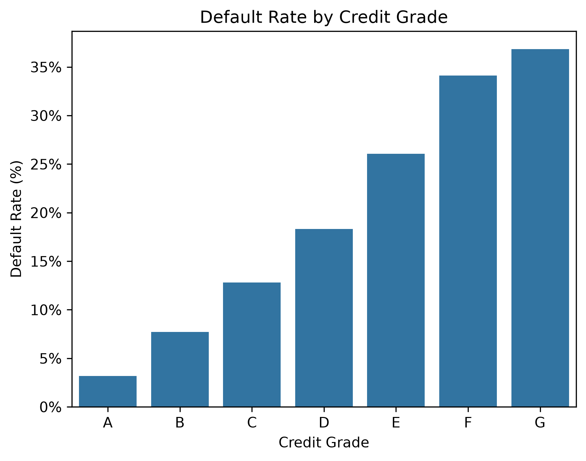
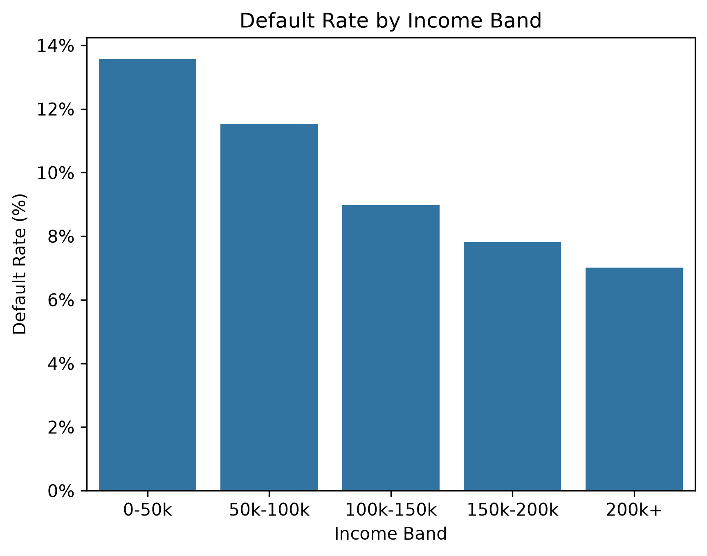
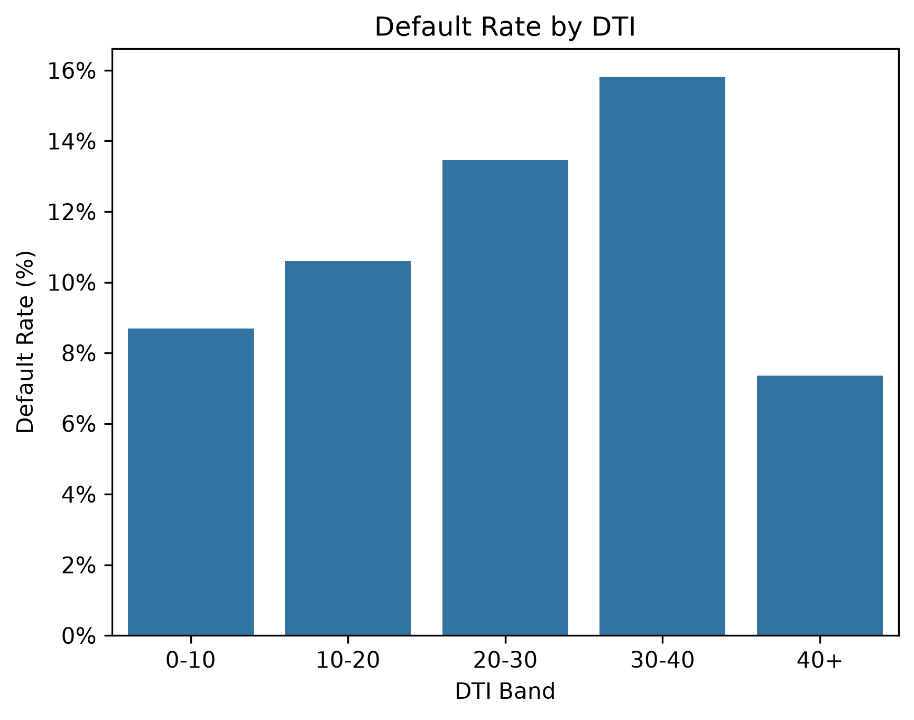
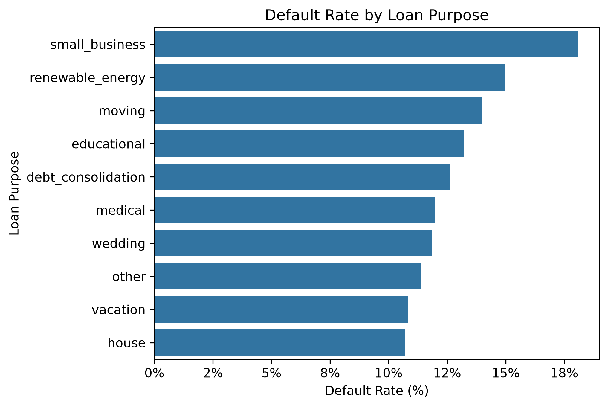

# Credit Risk Analysis – Loan Default Prediction Pipeline

## 📊 Project Overview

This project is an end-to-end credit risk analytics pipeline built using a large-scale LendingClub dataset. It simulates a real-world banking workflow by transforming raw loan data into an analysis-ready dataset and identifying key drivers of loan default risk across multiple analytical layers including SQL, Excel, and Python.

The project demonstrates a full analytics lifecycle: data cleaning, feature engineering, database analysis, and automated visual reporting.

---

## 🧠 Executive Summary

This project analyses a large-scale loan dataset to identify key drivers of credit risk and loan default. Across SQL, Excel, and Python-based analysis, the findings consistently show that borrower financial health and credit classification are the strongest predictors of default behaviour.

Default risk increases significantly with lower credit grades, higher debt-to-income ratios, and lower income levels. Certain loan purposes also exhibit elevated risk profiles.

A Python-based visualisation pipeline was later introduced to automate and validate these insights, producing reproducible charts for portfolio and reporting use.

---

## 🎯 Business Problem

Financial institutions must accurately assess borrower creditworthiness and understand the drivers of loan default. These insights are essential for improving lending decisions, reducing credit losses, and optimising risk-based pricing strategies.

---

## 📁 Dataset

- **Source:** LendingClub Loan Dataset  
- **Size:** ~2.2 million records  
- **Initial Features:** 145 columns  
- **Final Features Used:** 11 key variables  

---

## 🛠️ Tools & Technologies

- Python (Pandas, Matplotlib, Seaborn)
- PostgreSQL
- SQL
- pgAdmin
- Microsoft Excel
- VS Code

---

## ⚙️ Project Workflow

Raw LendingClub Dataset (CSV)  
↓  
Python Data Processing (Pandas)  
↓  
Schema Exploration & Validation  
↓  
Feature Selection (145 → 11 columns)  
↓  
Target Engineering (`default_flag`)  
↓  
Clean Dataset Export  
↓  
PostgreSQL Data Load  
↓  
SQL-Based Analysis  
↓  
Python Visualisation Pipeline (Seaborn / Matplotlib)  
↓  
Excel Dashboard  

---

## 🧹 Data Preparation & Feature Engineering

- Selected key variables relevant to credit risk analysis  
- Reduced dataset dimensionality from 145 to 11 columns  
- Created a binary target variable (`default_flag`) to identify loan defaults:
  - 1 → Charged Off / Default  
  - 0 → Non-default  
- Prepared dataset for structured analysis across SQL and Python environments  

---

## 🐍 Python Visualisation Pipeline (Step 11)

After completing SQL-based analysis, the project was extended using Python to build a reproducible analytics and visualisation pipeline.

Using Pandas, Matplotlib, and Seaborn, the cleaned dataset was re-analysed to validate key risk drivers and generate automated visual insights.

This approach enables consistent, reusable, and scalable credit risk reporting.

### Key analyses include:
- Default rate by credit grade  
- Default rate by income band  
- Default rate by debt-to-income (DTI) ratio  
- Default rate by loan purpose  

---

## 📊 Visual Analytics Dashboard (Python)

The Python pipeline generates automated visualisations that replicate and validate earlier SQL and Excel findings.

These charts highlight the strongest drivers of loan default risk across key borrower segments.

### Credit Grade vs Default Risk

### Income Band vs Default Risk

### Debt-to-Income (DTI) vs Default Risk

### Loan Purpose vs Default Risk

---

## 📊 Key Insights

- The overall loan default rate is approximately **11.6%**, indicating a moderate level of portfolio risk and a clear imbalance between performing and non-performing loans.

- **Credit grade is the strongest predictor of default risk**, showing a clear monotonic relationship where risk increases consistently from Grade A through to lower credit grades.

- **Income level demonstrates an inverse relationship with default probability**, with lower-income borrowers exhibiting significantly higher default rates.

- **Debt-to-income (DTI) ratio is a critical risk driver**, with higher leverage levels strongly associated with increased likelihood of default.

- **Loan purpose introduces meaningful segmentation in risk profiles**, with categories such as small business and personal loans showing elevated default rates.

- Overall, borrower financial strength and credit classification are the most significant indicators of credit risk in this dataset.

---

## 📁 SQL Analysis

All SQL queries used for analysis are stored in the `sql/analysis.sql` file.

---

## 🚀 How to Run This Project

1. Run the Python preprocessing script: (`python scripts/01_clean_data.py`) 

2. Generate Python Visualisations: (`python scripts/02_visualisations.py`)

2. Load the cleaned dataset (`clean_loans.csv`) into PostgreSQL using pgAdmin

3. Execute queries from `sql/analysis.sql` to reproduce analysis

---

## 🧾 Future Improvements

- Build interactive dashboards using Power BI or Excel slicers
- Develop predictive models (logistic regression, XGBoost)
- Automate full ETL + reporting pipeline
- Optimise database performance for large-scale queries
- Convert Python pipeline into modular production-style scripts

 ## 📌 Notes

- This project demonstrates a full credit risk analytics workflow combining SQL, Python, and Excel to replicate real-world financial risk reporting processes.
---